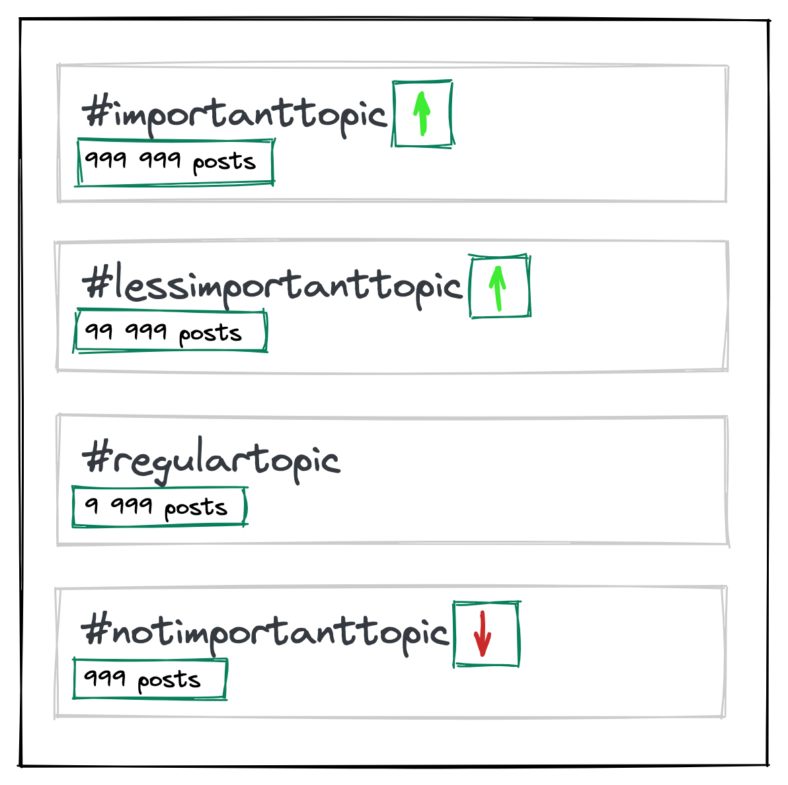
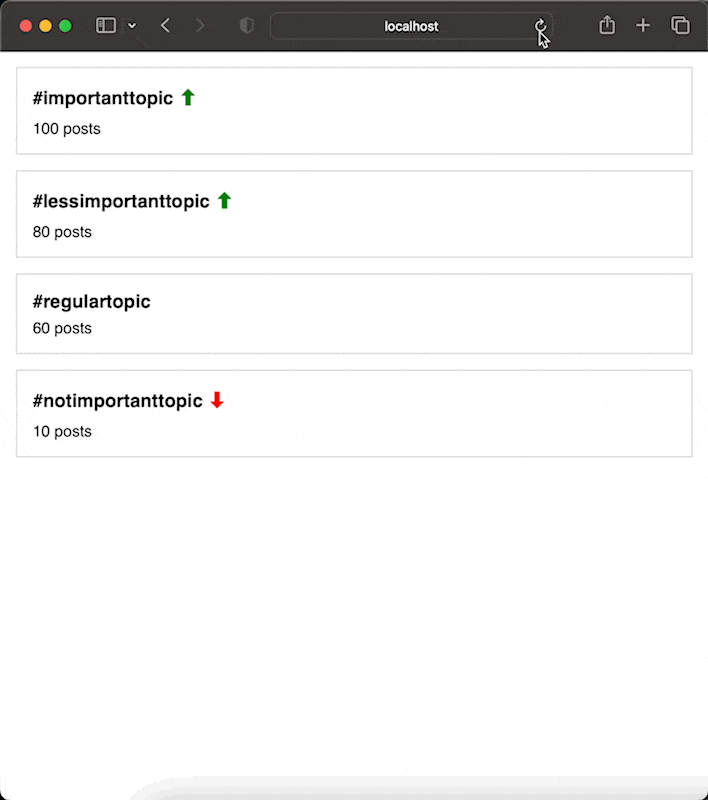

Turbo Frames is a new (not so new in <span suppressHydrationWarning>{new Date().getFullYear()}</span> actually) concept introduced as the part of
[Turbo](https://turbo.hotwired.dev/) and is designed to improve the perceived performance of web applications built
with Ruby on Rails.

With this new feature, it is possible to create complex web applications that have multiple dynamic UI elements that
can be updated independently, without reloading the entire page. For example, an e-commerce website can have a
shopping cart that is updated dynamically as the user adds items to it, without the need for a full page refresh.

The most straightforward and simple part of the feature are Eager-Loading Frames. Just add a tag with `id` and `src` attributes:

```html
<turbo-frame id="tag_1" src="/tags/1"></turbo-frame>
```

Turbo will call the page `/tags/1` , find the `turbo-frame` tag with `id="tag_1"` there, and insert its content into the `turbo-frame` on your page.

But what if I tell you that you can update any part of the page, not just `turbo-frame`’s content?

To illustrate what I mean let’s imagine a little example: a list of tags with post counters and an indicator of tag trendiness. Everything seems fine, but we don't have a posts counter cache for each tag, and we have to count posts on the fly each time. This calculated value will also be used to show the trendiness indicator.

And this is the part we can make asynchronous using Turbo Frames.



**Note:** I assume that you are familiar with Ruby on Rails so I’m skipping steps with creating new project, scaffolding views, etc.

The data model for this example is dead simple.

```ruby
class Tag < ApplicationRecord
  has_many :post_tags
  has_many :posts, through: :post_tags
end
```

```ruby
class PostTag < ApplicationRecord
  belongs_to :tag
  belongs_to :post
end
```

```ruby
class Post < ApplicationRecord
  has_many :post_tags
  has_many :tags, through: :post_tags
end
```

Each tag has a **`/stats`** endpoint, which we will call to get the posts count and trendiness:

```ruby
resources :tags do
  member do
    get :stats
  end
end
```

A template for each tag in the list looks like this. Pay attention to the three **`turbo-frame`** tags in the example:

- The first one has an **`src`** attribute and will trigger stats loading once it's rendered on the page.
- The rest of the tags will be updated by the response from **`stats_tag_path(tag)`**.

```html
<div id="<%= dom_id tag %>" class="tag">
  <turbo-frame id="tag_stats" src="<%= stats_tag_path(tag) %>"></turbo-frame>

  <h3 class="tag-name">
    #<%= tag.name %>

    <turbo-frame id="<%= dom_id tag, 'trendiness' %>"></turbo-frame>
  </h3>
  <div class="tag-count">
    <turbo-frame id="<%= dom_id tag, 'posts_count' %>"></turbo-frame>
  </div>
</div>
```

And here is out controller

```ruby
class TagsController < ApplicationController
  include ActionView::RecordIdentifier
  include ActionView::Helpers::TextHelper

  before_action :set_tag, only: %i[stats show edit update destroy]

  def stats
    posts_count_percentage = @tag.posts.count * 100 / Post.count

    trendiness = if posts_count_percentage > 25
       '<span class="trend-up">⬆</span>'
    elsif posts_count_percentage < 5
       '<span class="trend-down">⬇</span>'
    else
      ''
    end

    render turbo_stream: [
      turbo_stream.replace(dom_id(@tag, 'trendiness'), trendiness),
      turbo_stream.replace(dom_id(@tag, 'posts_count'), pluralize(@tag.posts.count, 'post')),
    ]
  end

  # and other standard CRUD action...
end
```

The most interesting thing here is

```ruby
render turbo_stream: [
  turbo_stream.replace(dom_id(@tag, 'trendiness'), trendiness),
  turbo_stream.replace(dom_id(@tag, 'posts_count'), pluralize(@tag.posts.count, 'post')),
]
```

Instead of the regular HTML render we use **`turbo_stream`** format to specify that the response will be a Turbo Stream.

The Turbo Stream response contains an array of operations that will be performed on the client-side view. In this case, the array contains two operations.

First  **`turbo_stream.replace(dom_id(@tag, 'trendiness'), trendiness)`** replaces the contents of an HTML element with the id **`dom_id(@tag, 'trendiness')`** with the value of **`trendiness`**. The **`dom_id`** method generates a unique id for the element based on the **`@tag`** object and the **`trendiness`** string.

And the second **`turbo_stream.replace`** does pretty much the same.

Overall, this code is sending a Turbo Stream response that updates two elements in the client-side view with new values based on the **`@tag`** object and its associated data.

And the result page will look like this. You can see that the posts count and green/red arrows load asynchronously now.


